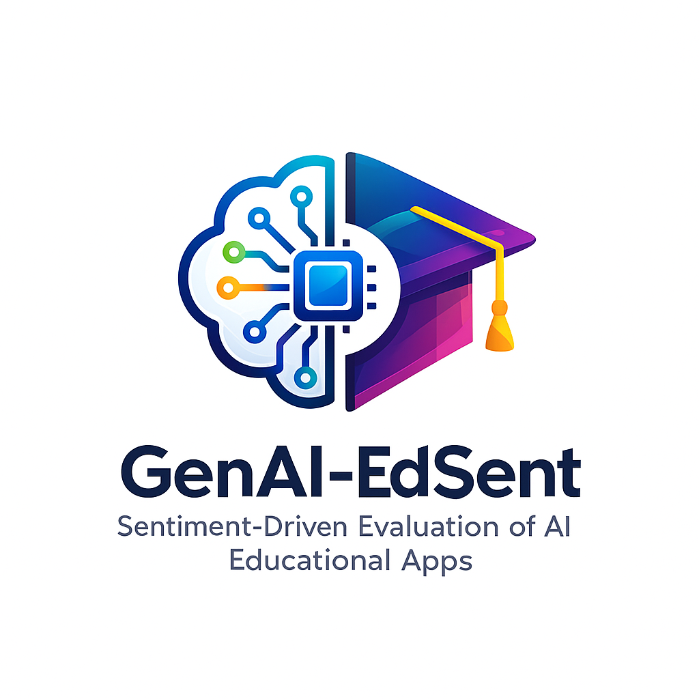
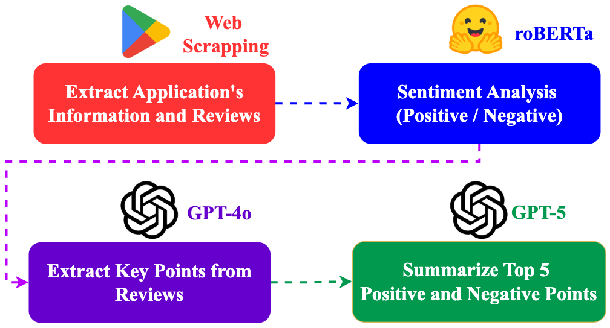
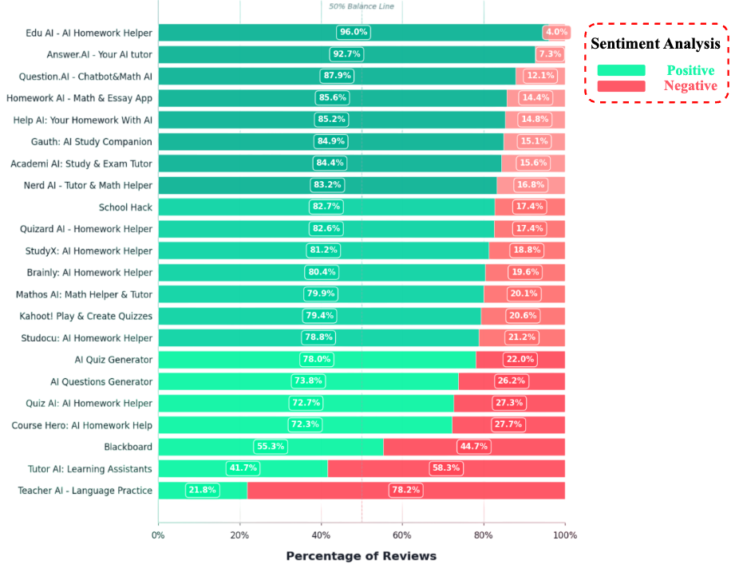

<div align="center">



# 🎓 GenAI-EdSent: Sentiment-Driven Evaluation of AI Educational Apps

[](https://www.python.org/downloads/)
[](LICENSE)
[](Final_Paper.pdf)
[](https://huggingface.co/datasets/Erfan-Nourbakhsh/GenAI-EdSent)
[]()

*Unveiling User Perceptions in the Generative AI Era Through Large-Scale Sentiment Analysis*

[Overview](#-overview) •
[Key Findings](#-key-findings) •
[Methodology](#%EF%B8%8F-methodology) •
[Results](#-results) •
[Dataset](#-dataset) •
[Installation](#-installation) •
[Citation](#-citation)

</div>

---

## 📖 Overview

The integration of **Generative AI** into education has sparked a digital transformation in e-teaching, yet user perceptions of AI educational apps remain critically underexplored. This research project bridges that gap through a comprehensive **sentiment-driven evaluation** of user reviews from top AI educational apps on the Google Play Store.

### 🎯 Research Objectives

1. **Quantify sentiment distributions** and distill key positive/negative themes across app categories
2. **Compare performance trends** among different app types (homework helpers, math solvers, LMS, etc.)
3. **Propose future directions** for AI educational ecosystems with hybrid AI-human models

### 📄 Associated Paper

**Title:** *Unveiling User Perceptions in the Generative AI Era: A Sentiment-Driven Evaluation of AI Educational Apps' Role in Digital Transformation of E-Teaching*

**Authors:** Adeleh Mazaheriyan (Islamic Azad University) & Erfan Nourbakhsh (University of Isfahan)

**Abstract:** This study performs a sentiment-driven evaluation of user reviews from 22 top AI ed-apps on the Google Play Store to assess efficacy, challenges, and pedagogical implications. Our pipeline leverages **RoBERTa** for binary sentiment classification, **GPT-4o** for key point extraction, and **GPT-5** for synthesizing top positive/negative themes. Results reveal predominantly positive sentiments, with homework apps leading (e.g., Edu AI: 95.9% positive) while specialized LMS/language apps lag due to stability issues.

---

## 📊 Research at a Glance

<div align="center">

| 📱 Apps Analyzed | 💬 Reviews Processed | 🤖 AI Models Used | 📚 Categories | 🌍 Dataset Access |
|:----------------:|:-------------------:|:----------------:|:-------------:|:-----------------:|
| **22** | **481,000+** | **3** (RoBERTa, GPT-4o, GPT-5) | **7** | [🤗 Hugging Face](https://huggingface.co/datasets/Erfan-Nourbakhsh/GenAI-EdSent) |

</div>

<div align="center">

### 🔥 Quick Stats

🎯 **96.0%** positive sentiment for top performer (Edu AI)  
⚡ **481K** training reviews • **481K** validation samples  
📈 **4.43M** total ratings across all apps  
🏆 **85%** average positive sentiment for homework helpers  
⚠️ **21.8%** positive sentiment for lowest performer (Teacher AI)

</div>

---

## 🔍 Key Findings

### 📊 Sentiment Distribution Highlights

- **Homework Helpers** dominate with ~85% positive sentiment
  - 🥇 **Edu AI**: 96.0% positive (accuracy, speed, personalization)
  - 🥈 **Answer.AI**: 92.7% positive (24/7 tutoring, step-by-step explanations)
  
- **Math-Focused Solvers** show strong performance (~80% positive)
  - Users praise problem-solving efficiency and photo recognition
  
- **Language/LMS Apps** lag behind (20-40% positive)
  - ⚠️ **Teacher AI**: 21.8% positive (instability, limited features)
  - Issues: crashes, paywalls, feature gaps

### 🌟 Top Positive Themes

1. ⚡ **Efficiency & Speed** - Quick solutions for homework and brainstorming
2. 🎯 **Personalized Learning** - Step-by-step explanations tailored to student needs
3. 🎮 **Engagement** - Gamification and community features boost motivation
4. 🌍 **Accessibility** - Democratizing education for under-resourced areas
5. 🤝 **Multi-Subject Support** - Versatile tools across STEM and humanities

### ⚠️ Top Negative Themes

1. 💰 **Aggressive Monetization** - Restrictive paywalls limiting free features
2. ❌ **Inaccuracies** - Wrong answers eroding trust, especially in specialized domains
3. 📺 **Excessive Ads** - Disrupting learning flow
4. 🐛 **Technical Glitches** - Crashes, slow loading, notation failures
5. ⚖️ **Equity Concerns** - Digital divide and over-reliance risks

---

## 🛠️ Methodology

Our systematic pipeline combines **web scraping**, **transformer-based NLP**, and **large language models** to analyze authentic user feedback at scale.

<div align="center">


*Figure 1: Multi-stage workflow from data collection to theme synthesis*

</div>

### 🔄 Pipeline Stages

#### 1️⃣ **App Selection & Categorization**
- Selected **22 prominent AI education apps** based on ratings, downloads, and GenAI integration
- Categorized into **7 functional types** with overlaps for multifunctional designs:
  - 📝 AI Quiz & Question Generators
  - 🎒 All-in-One Study Companions
  - ✏️ Homework Helpers
  - 🔢 Math-Focused Solvers & Specialized Tools
  - 📄 Document/Content Tools
  - 🏫 Learning Management Systems (LMS)
  - 🌐 Language Learning Apps

#### 2️⃣ **Data Collection**
- **Web scraping** from Google Play Store using Python
- Collected app metadata + verbatim user reviews (up to November 2025)
- Dataset: **Tens of thousands to millions** of reviews per app

#### 3️⃣ **Sentiment Analysis & Theme Extraction**

| Stage | Model | Purpose |
|-------|-------|---------|
| **Binary Classification** | [RoBERTa](https://arxiv.org/abs/1907.11692) | Transformer-based sentiment labeling (positive/negative) |
| **Key Point Extraction** | [GPT-4o](https://arxiv.org/abs/2410.21276) | Distill recurring themes and pain points |
| **Theme Synthesis** | GPT-5 | Generate top 5 positive/negative summaries |

#### 4️⃣ **Aggregation & Trend Analysis**
- Computed sentiment percentages per app and category
- Enabled cross-app performance comparisons

---

## 📈 Results

<div align="center">


*Figure 2: Positive vs. negative sentiment percentages across 22 AI educational apps*

</div>

### 🏆 Top Performers

| Rank | App | Category | Positive % |
|------|-----|----------|-----------|
| 1 | Edu AI | Homework Helper | **96.0%** |
| 2 | Answer.AI | Multi-Tool | **92.7%** |
| 3 | Question.AI | Chatbot/Math | **87.9%** |
| 4 | Homework AI | Math/Essay | **85.6%** |
| 5 | Help AI | Homework Helper | **85.2%** |

### ⚠️ Areas for Improvement

| Rank | App | Category | Positive % | Key Issues |
|------|-----|----------|-----------|------------|
| 22 | Teacher AI | Language | **21.8%** | Instability, limited features |
| 21 | Tutor AI | Learning Assistant | **41.7%** | Narrow functionality |
| 20 | Blackboard | LMS | **53.3%** | Technical glitches |

### 📊 Category-Level Insights

- **Homework Helpers**: Average 85% positive → Strong personalization and speed
- **Math Solvers**: Average 80% positive → Photo recognition praised, notation failures criticized
- **LMS/Language Apps**: Average 35% positive → Urgent need for stability improvements

---

## 💡 Future Directions

### 🔮 Proposed Innovations

1. **Hybrid AI-Human Models** 🤝
   - Combine app strengths (real-time assistance) with teacher oversight
   - Mitigate risks like inaccuracies and over-dependency

2. **VR/AR Integration** 🥽
   - Immersive learning experiences (virtual labs, interactive simulations)
   - Address gaps in engagement and multimodal inputs

3. **Ethical AI Roadmap** ⚖️
   - **For Developers**: Adaptive personalization, plagiarism detection, equitable monetization
   - **For Policymakers**: Mandated free tiers, accuracy standards, data privacy protections

---

## 📊 Dataset

### 🤗 Complete Dataset on Hugging Face

The full dataset containing **481,000+ app reviews** from 22 AI educational apps is publicly available on Hugging Face:

**🔗 [GenAI-EdSent Dataset on Hugging Face](https://huggingface.co/datasets/Erfan-Nourbakhsh/GenAI-EdSent)**

The dataset includes:
- **App Information**: Metadata for all 22 applications (ratings, descriptions, install counts)
- **User Reviews**: Complete review texts with scores, timestamps, and sentiment labels
- **Sentiment Analysis Results**: Binary classification outputs from RoBERTa
- **Extracted Insights**: Key positive/negative themes per application

### 📁 Repository Data Files

This repository includes curated analysis outputs:

#### 1. **App_Ratings.json** - Application Metadata

Contains Google Play Store ratings and summaries for all 22 apps:

<details>
<summary>📋 View Sample Data</summary>

```json
{
  "name": "Edu AI - AI Homework Helper",
  "summary": "AI Homework Helper - Math, Physics, Chemical, etc.",
  "app_score": 4.55
},
{
  "name": "Answer.AI - Your AI tutor",
  "summary": "Scan and Get Instant Answers on Your Phone",
  "app_score": 4.73
}
```

**Top Rated Apps:**
- 🥇 Studocu: 4.86/5 ⭐
- 🥈 Gauth: 4.77/5 ⭐
- 🥉 Kahoot!: 4.74/5 ⭐

**Lowest Rated Apps:**
- ⚠️ Teacher AI: 2.29/5 ⭐
- ⚠️ Blackboard: 3.39/5 ⭐
- ⚠️ Tutor AI: 3.40/5 ⭐

</details>

#### 2. **Top_5_Points.json** - Sentiment Themes Per App

Contains the top 5 positive and negative points extracted for each application using GPT-4o and GPT-5:

<details>
<summary>📋 View Sample Analysis (Edu AI)</summary>

**Positive Points:**
1. ✅ The app enables users to complete homework tasks effectively
2. ✅ The app delivers perfect-quality assignment outputs that meet high standards

**Negative Points:**
1. ❌ The app returns answers in Spanish instead of matching the user's preferred language
2. ❌ Text is displayed in a font size that is too small to read comfortably

</details>

<details>
<summary>📋 View Sample Analysis (Answer.AI)</summary>

**Positive Points:**
1. ✅ Reliably helps students complete homework across subjects and grade levels
2. ✅ Consistently delivers accurate, correct answers
3. ✅ Explains solutions step by step with reasoning
4. ✅ Provides answers very quickly with fast response times
5. ✅ Easy to use with intuitive interface and camera/scan input

**Negative Points:**
1. ❌ Frequently provides incorrect or incomplete answers (especially math/graphs)
2. ❌ Core features locked behind expensive paywall
3. ❌ Restrictive energy/points system limits free usage
4. ❌ App instability with crashes and broken features
5. ❌ Unreliable camera/scan and image recognition

</details>

**Key Insights from Theme Analysis:**
- **Most Praised**: Homework efficiency, step-by-step explanations, speed
- **Most Criticized**: Paywalls, accuracy issues, technical instability
- **Category Trends**: Homework helpers excel; LMS/language apps struggle

---

## 🚀 Installation

### Prerequisites

```bash
Python 3.8+
pip
```

### Setup

```bash
# Clone the repository
git clone https://github.com/erfan-nourbakhsh/GenAI-EdSent.git
cd GenAI-EdSent

# Install dependencies
pip install -r requirements.txt
```

### Required Libraries

- `transformers` (RoBERTa model)
- `openai` (GPT API access)
- `beautifulsoup4` / `selenium` (web scraping)
- `pandas`, `numpy` (data processing)
- `matplotlib`, `seaborn` (visualization)

---

## 📁 Repository Structure

```
GenAI-EdSent/
│
├── Figures/
│   ├── logo.png                   # Project logo
│   ├── approach.png               # Methodological pipeline diagram
│   └── results.png                # Sentiment analysis results chart
│
├── Data Files/
│   ├── App_Ratings.json           # App metadata & Google Play ratings (22 apps)
│   └── Top_5_Points.json          # Top 5 positive/negative themes per app
│
├── Python Scripts/
│   ├── Positive_Negative_Points_Classifier.py    # RoBERTa sentiment classification
│   ├── Positive_Negative_Points_Generator.py     # GPT-4o key point extraction
│   └── Top_5_Points_Generator.py                 # GPT-5 theme synthesis
│
├── Final_Paper.pdf                # Full research paper
├── README.md                      # This file
├── LICENSE                        # MIT License
└── requirements.txt               # Python dependencies
```

**Note:** Full dataset with 481+ reviews available on [🤗 Hugging Face](https://huggingface.co/datasets/Erfan-Nourbakhsh/GenAI-EdSent)

---

## 🔬 Usage

### 1. Sentiment Classification

```python
# Run RoBERTa-based sentiment analysis
python Positive_Negative_Points_Classifier.py
```

### 2. Extract Key Points

```python
# Use GPT-4o to extract themes from reviews
python Positive_Negative_Points_Generator.py
```

### 3. Generate Top Themes

```python
# Synthesize top 5 positive/negative points with GPT-5
python Top_5_Points_Generator.py
```

---

## 📚 Citation

If you use this work in your research, please cite:

```bibtex
@article{mazaheriyan2025genai,
  title={Unveiling User Perceptions in the Generative AI Era: A Sentiment-Driven Evaluation of AI Educational Apps' Role in Digital Transformation of E-Teaching},
  author={Mazaheriyan, Adeleh and Nourbakhsh, Erfan},
  journal={arXiv preprint},
  year={2025}
}
```

---

## 👥 Meet the Researchers

<div align="center">

### 🌟 Behind the Research

*A collaborative effort bridging **educational theory** and **AI technology** to understand how generative AI is reshaping learning experiences worldwide.*

</div>

<table>
  <tr>
    <td align="center" width="50%">
      
      <h3>🎓 Adeleh Mazaheriyan</h3>
      <p><em>Education Researcher</em></p>
      <p>
        <strong>Department of Education</strong><br>
        Islamic Azad University, Isfahan, Iran
      </p>
      <p>
        Specializes in <strong>pedagogical evaluation</strong> and <strong>digital transformation in e-teaching</strong>, bringing educational theory perspective to AI assessment.
      </p>
      <p>
        📧 <a href="mailto:adelehmazaheriyan@gmail.com">adelehmazaheriyan@gmail.com</a>
      </p>
    </td>
    <td align="center" width="50%">
      
      <h3>🤖 Erfan Nourbakhsh</h3>
      <p><em>AI Researcher & Developer</em></p>
      <p>
        <strong>Artificial Intelligence Department</strong><br>
        University of Isfahan, Iran
      </p>
      <p>
        Expert in <strong>NLP</strong>, <strong>sentiment analysis</strong>, and <strong>LLM applications</strong>, developing the technical pipeline for large-scale review analysis.
      </p>
      <p>
        📧 <a href="mailto:erfannourbakhsh2001@gmail.com">erfannourbakhsh2001@gmail.com</a>
      </p>
    </td>
  </tr>
</table>

<div>

### 🤝 Interdisciplinary Collaboration

This research exemplifies the power of **interdisciplinary collaboration**, combining:
- 📚 **Educational Theory** → Understanding pedagogical implications
- 🧠 **AI/ML Technology** → Analyzing 960K+ reviews at scale  
- 📊 **Data Science** → Extracting actionable insights for stakeholders

*Together, we're working to ensure AI in education serves all learners equitably.*

</div>

---

## 🤝 Contributing

Contributions are welcome! Please feel free to submit a Pull Request. For major changes, please open an issue first to discuss proposed changes.

---

## 📄 License

This project is licensed under the MIT License - see the [LICENSE](LICENSE) file for details.

---

## 🌟 Acknowledgments

We extend our gratitude to:

- **Microsoft Education** for the [2025 AI in Education Report](https://educate.microsoft.com/)
- **RAND Corporation** for K-12 AI adoption insights and teacher engagement studies
- **OpenAI & Hugging Face** for providing access to state-of-the-art language models (GPT-4o, GPT-5, RoBERTa)
- **Google Play Store** developers and the educational AI community
- **Thousands of users** whose reviews made this research possible

---

## 📞 Contact & Collaboration

We welcome questions, feedback, and collaboration opportunities!

**For Research Inquiries:**
- 📧 Email: erfannourbakhsh2001@gmail.com or adelehmazaheriyan@gmail.com
<!-- - 📄 Full Paper: [Final_Paper.pdf](Final_Paper.pdf) -->
- 🤗 Dataset: [Hugging Face](https://huggingface.co/datasets/Erfan-Nourbakhsh/GenAI-EdSent)

**Interested in:**
- Collaborative research on AI in education?
- Extending this analysis to other platforms (Apple App Store, web apps)?
- Developing predictive models for app success?
- Contributing to the codebase?

*We'd love to hear from you!* 💬

---

<div align="center">

### ⭐ If you find this research useful, please star the repository! ⭐

[](https://github.com/erfan-nourbakhsh/GenAI-EdSent)

*Advancing equitable, innovative e-teaching through user-driven AI insights*

---

Made with ❤️ for the future of education

</div>

